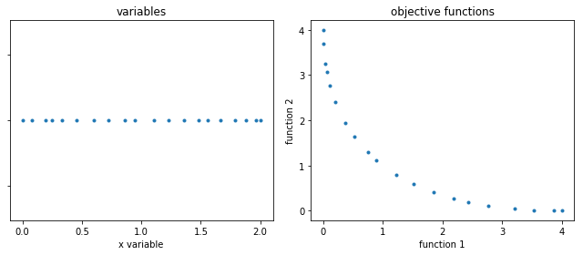
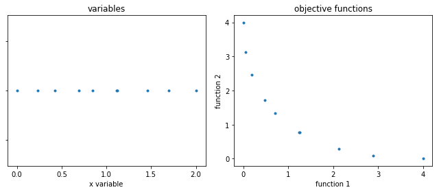
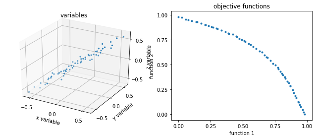
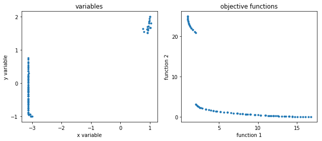
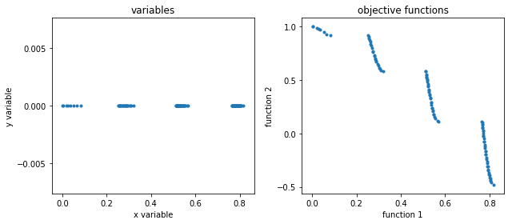

# SPEA2
> Strength Pareto Evolutionary Algorithm v2 

## Screenshots

## Technologies
* Python 3.7.3

## Inspiration
* Test cases specified in this script are implementations of the MOP functions specified in "Evolutionary Algorithms for Solving Multi-Objective Problems"
ISBN 1475751842, 9781475751840
* Base of the project is also based on the work of the user /Valdecy, but simplified